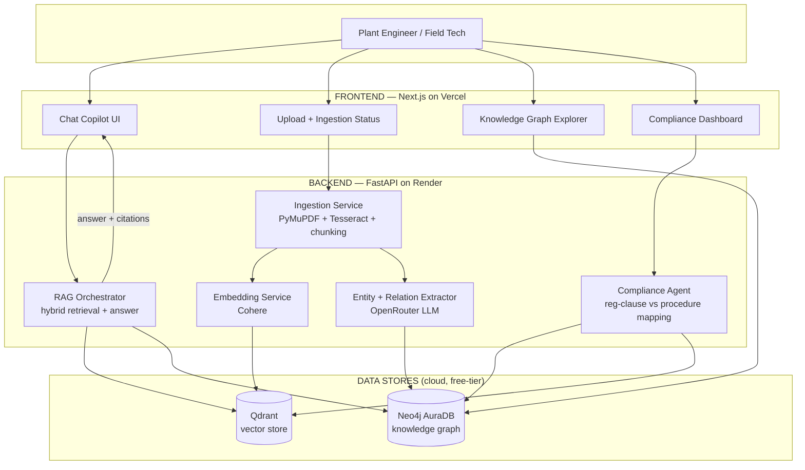

# CLAUDE.md

# OpsBrain — Industrial Knowledge Intelligence Platform
### ET AI Hackathon 2026 · Problem Statement #8 (Unified Asset & Operations Brain)
**Team of 4 · Build window: 3 July → 22 July 2026 (~19 days)**

CURRENT PHASE: Phase 1 — repo scaffolding + ingestion pipeline only.
Do not build the Neo4j graph or compliance agent yet.
---

## 0. Read this first (30-second summary)

We are building **OpsBrain**: an AI platform that eats a messy pile of industrial documents — OEM equipment manuals, maintenance work orders, safety procedures, inspection reports, and government regulations (OISD / Factory Act) — and turns them into a single **queryable brain**.

A plant engineer can ask it a plain-English question ("What is the overhaul interval for Pump P-101 and are we compliant with OISD-132?") and get back a **cited, trustworthy answer** in seconds, backed by a **knowledge graph** that connects equipment → procedures → regulations → history.

**Why this problem:** It is RepoChat's architecture (RAG over documents with citations) scaled up to an industrial use case, plus two new differentiators (a knowledge graph and a compliance-gap agent). We already own 80% of this stack. We are not learning a new language under deadline pressure — we are extending something we've shipped before.

**The three pillars judges will score us on:**
1. **The Copilot** — ask anything, get a cited answer (our RepoChat muscle).
2. **The Knowledge Graph** — the "wow" differentiator; answers questions pure search can't.
3. **The Compliance Agent** — the business-impact story; auto-flags regulatory gaps.

---

## 1. What we are actually building (feature scope)

| # | Feature | What the user sees | Priority |
|---|---------|--------------------|----------|
| F1 | **Document Ingestion** | Drag-drop PDFs / scanned docs / spreadsheets → they get processed with a live status bar | MUST |
| F2 | **Expert Copilot (RAG)** | Chat box. Ask a question → get an answer **with citations** linking back to the exact source doc + page | MUST |
| F3 | **Knowledge Graph** | An interactive graph: equipment tags, procedures, regulations, people, dates — all linked. Click a node to explore | MUST |
| F4 | **Graph-Enriched Answers** | The Copilot uses the graph to answer relational questions ("what regulations affect equipment maintained by Team B?") that plain search fails | SHOULD |
| F5 | **Compliance Gap Agent** | A dashboard that maps regulatory clauses against our procedures and **flags gaps** in red, with evidence | SHOULD |
| F6 | **Mobile-friendly view** | The Copilot works on a phone (for "field technicians") | NICE |

> **De-scope rule:** F1, F2, F3 are the non-negotiable spine. If we fall behind, we cut F6 first, then F5's dashboard polish (keep the logic, simplify the UI). We never cut citations — that's what makes the demo credible.

---

## 2. Why our stack (and why free-tier works)

Everything below has a **free tier that comfortably handles a demo-sized corpus** (a few hundred document pages). We are reusing the RepoChat toolchain wherever possible.

| Layer | Tool | Why | Cost |
|-------|------|-----|------|
| Embeddings | **Cohere `embed-english-v3.0`** | Already used in RepoChat, strong retrieval | Free tier |
| Vector DB | **Qdrant Cloud** | Already used in RepoChat, 1 GB free | Free |
| Graph DB | **Neo4j AuraDB Free** | 200k nodes / 400k rels — plenty for demo; industry-standard, great for the deck | Free |
| LLM (answers + extraction) | **OpenRouter** (multi-model fallback) | Already used in RepoChat; free models + fallback chain | Free |
| OCR (scanned docs) | **Tesseract** (local) | Open-source, runs on macOS, no API cost | Free |
| PDF parsing | **PyMuPDF (fitz)** + **pdfplumber** | Fast text + table extraction | Free |
| Backend framework | **FastAPI (Python)** | Already used in RepoChat | Free |
| Frontend framework | **Next.js + React** | Already used in RepoChat | Free |
| Graph visualization | **react-force-graph** (or vis-network) | Renders the KG interactively in-browser | Free |
| Styling | **Tailwind CSS** | Fast, clean, mobile-responsive | Free |
| Backend hosting | **Render** (free web service) | Already used in RepoChat; pin Python 3.11 via `runtime.txt` | Free |
| Frontend hosting | **Vercel** | Already used in RepoChat | Free |
| Uptime (no cold starts) | **UptimeRobot** | Pings Render so the demo doesn't cold-start | Free |

> **macOS 12.7 / 2016 MacBook note:** Tesseract, PyMuPDF, Neo4j driver, and Node all run fine on Intel macOS 12. Neo4j itself lives in the **cloud** (AuraDB) — we do **not** run a local graph DB, so no heavy local install. If anyone's machine struggles, ingestion can be run by whoever has the strongest machine and the vectors/graph are shared via the cloud services.

---

## 3. Architecture (the big picture)



**The data flow in words:**
1. User uploads documents (F1) → **Ingestion Service** extracts text (OCR if scanned), splits into chunks.
2. Each chunk → **Cohere embedding** → stored in **Qdrant**.
3. Each chunk also → **LLM entity extractor** → pulls out equipment tags, regulations, procedures, dates, people + their relationships → stored in **Neo4j**.
4. User asks a question → **RAG Orchestrator** does **hybrid retrieval**: pulls relevant chunks from Qdrant AND relevant subgraph from Neo4j → feeds both to the LLM → returns a **cited answer**.
5. **Compliance Agent** walks the graph, maps regulation nodes to procedure nodes, and flags any regulation with no matching/compliant procedure.

---

## 4. BACKEND — detailed breakdown

Language: **Python 3.11** · Framework: **FastAPI** · Repo: `opsbrain-backend`

### B1. Ingestion Service  `/ingest`
**Job:** turn any uploaded file into clean, chunked text.
- Accept PDF, scanned-PDF/image, XLSX/CSV.
- **PyMuPDF** for native-text PDFs; **pdfplumber** for tables; **Tesseract** OCR fallback when a page has no extractable text (scanned docs).
- Clean + normalize text (strip headers/footers, fix line breaks).
- **Chunking:** ~500–800 token chunks with ~100 token overlap. Attach metadata to every chunk: `{source_filename, page_number, doc_type, chunk_id}`.
- Output: a list of chunks ready for B2 and B3.

### B2. Embedding + Vector Store  (feeds Qdrant)
- Batch chunks → **Cohere `embed-english-v3.0`** (respect free-tier rate limits — batch and add a small delay, same lesson as RepoChat).
- Upsert vectors + metadata into a **Qdrant** collection.
- Expose a `search(query, top_k)` function returning chunks + scores.

### B3. Entity + Relation Extractor  (feeds Neo4j)
**This is the differentiator — assign your strongest backend person here.**
- For each chunk, call an **OpenRouter LLM** with a **structured-output prompt** that returns JSON only (same trick as RepoChat's JSON parsing):
  - **Entities:** `Equipment` (tags like P-101, V-204), `Procedure`, `Regulation` (OISD-132, Factory Act §), `Person/Team`, `Date`, `Parameter` (pressure, temp).
  - **Relationships:** `GOVERNED_BY` (equipment→regulation), `HAS_PROCEDURE` (equipment→procedure), `MAINTAINED_BY` (equipment→team), `REFERENCES` (procedure→regulation).
- **Keep the schema small on purpose:** ~6 node types, ~4 relationship types. Do NOT try to model everything.
- Deduplicate entities (P-101 mentioned in 5 docs = one node) and write nodes/edges to **Neo4j** via the Python driver, keeping a link back to the source chunk.

### B4. RAG Orchestrator  `/ask`
**Job:** answer a question with citations.
- **Step 1 — Vector retrieval:** call B2 `search()` → top chunks.
- **Step 2 — Graph retrieval:** extract entities from the question, look them up in Neo4j, pull their connected subgraph (1–2 hops). This is what lets us answer relational questions.
- **Step 3 — Answer generation:** feed retrieved chunks + graph context to the **OpenRouter LLM** with a strict prompt: "Answer only from the provided context. Cite every claim with [source, page]. If not in context, say so."
- **Step 4:** return `{answer, citations[], graph_context[]}`.
- Multi-model fallback chain (reuse RepoChat's OpenRouter fallback logic) so a rate-limited free model doesn't kill the demo.

### B5. Compliance Gap Agent  `/compliance`
**Job:** the business-impact feature.

**v1 (built):** overdue-maintenance gaps, not regulation/procedure clause
matching. Queries Neo4j for `MaintenanceEvent` nodes flagged `overdue`, joined
to their `Equipment` and `Location`, and returns `{equipment_tag, location,
next_due_date, days_overdue, severity, issue_found, source_document,
page_number}` with `severity` (`high` >90 days / `medium` 30-90 / `low` <30)
computed fresh against the current date. This is the whole check today — it
does not touch `Regulation` nodes.

**Original vision (future extension, not yet built):**
- Query Neo4j for all `Regulation` nodes.
- For each regulation, check whether a `Procedure` node `REFERENCES` it and whether that procedure looks current/compliant (use the LLM to judge the procedure text against the regulation text).
- Return a list: `{regulation, status: OK | GAP | STALE, evidence, linked_procedure}`.
- This can run on-demand from the dashboard button.
- Blocked on `Procedure` nodes existing in the graph — we have no procedure documents ingested yet, so there's nothing to match regulations against. Add this once real procedure docs are in the corpus.

### B6. API layer + glue
- FastAPI endpoints: `POST /upload`, `POST /chat`, `GET /graph`, `GET /compliance`, `GET /health`. (Named to match the frontend's existing page routes — `upload/`, `chat/` — not the `/ingest`/`/ask` names originally sketched here.)
- CORS for the Vercel frontend.
- `runtime.txt` → `python-3.11.0` (RepoChat lesson — avoids Render defaulting to 3.14).
- `numpy<2.0` pin if any dependency drags in numpy (RepoChat lesson).
- Environment variables (see §8) — never commit keys.

---

## 5. FRONTEND — detailed breakdown

Language: **TypeScript** · Framework: **Next.js (React)** · Styling: **Tailwind** · Repo: `opsbrain-frontend`

### F-A. Upload & Ingestion screen
- Drag-and-drop zone (multi-file).
- POST files to `/ingest`, show a **live status list** (Uploaded → Extracting → Embedding → Graphing → Done) per file.
- Small "corpus summary" card: X documents, Y chunks, Z entities indexed.

### F-B. Copilot chat screen  (the hero screen)
- Clean chat interface (reuse RepoChat's chat UX).
- Render the answer with **inline citation chips** — clicking a chip opens the source doc at the cited page (or shows the chunk in a side panel).
- Show a small "graph context used" strip when graph retrieval contributed — this visibly demonstrates the KG is doing work (great for the demo).
- Loading/streaming states.

### F-C. Knowledge Graph Explorer
- Fetch graph from `GET /graph`, render with **react-force-graph**.
- Color-code node types (Equipment / Procedure / Regulation / Team).
- Click a node → side panel with its details + connected docs.
- Search/filter box to jump to a node.

### F-D. Compliance Dashboard
- Button: "Run Compliance Scan" → calls `/compliance`.
- Table of regulations with **red / amber / green** status + evidence + link to the procedure.
- A headline stat: "N regulations checked · M gaps found" (this number is your business-impact slide).

### F-E. Shell, theme, mobile
- Nav/layout, dark industrial theme, responsive so F-B works on mobile.
- Deploy to **Vercel**, point API base URL at the Render backend.

---

## 6. Work division — who does what

Four people. Two lean backend, two lean frontend, but everyone owns a vertical slice so no one is blocked.

| Person | Primary ownership | Secondary |
|--------|-------------------|-----------|
| **Ishan (Backend Lead)** | B1 Ingestion + B4 RAG Orchestrator (the spine you know best) + overall architecture, deployment (Render), env/keys | Reviews B3 graph integration |
| **Backend Dev (person 2)** | B3 Entity/Relation Extractor + Neo4j schema + B5 Compliance Agent (the two novel pieces) | Helps B2 embeddings |
| **Frontend Dev (person 3)** | F-B Copilot chat + F-A Upload + citation rendering | Integrates `/ask` + `/ingest` |
| **Frontend/Full-stack (person 4)** | F-C Graph Explorer + F-D Compliance Dashboard + F-E theme/mobile + **deck + demo video** | Helps wire `/graph` + `/compliance` |

> **Interface contract first:** On Day 2, backend + frontend agree on the exact JSON shapes for `/ingest`, `/ask`, `/graph`, `/compliance`. Frontend then builds against **mock JSON** so nobody waits on the backend. This is the single most important coordination step.

---

## 7. Step-by-step plan (serial, with dates)

### Phase 0 — Setup & data (Days 1–2 · Jul 3–4)
1. Create both repos (`opsbrain-backend`, `opsbrain-frontend`), a shared Notion/Doc, a WhatsApp/Discord channel.
2. Create all cloud accounts + get keys (see §8). One person owns each account.
3. **Collect the corpus** (critical — do this early): download ~50–150 pages of **real public industrial docs**:
   - OISD guidelines (publicly available safety standards).
   - Factory Act text.
   - A few public OEM equipment manuals (pumps/compressors — findable online as PDFs).
   - Invent 3–4 short "maintenance work orders" and "procedures" ourselves that reference the above (so the graph has rich links + a deliberate compliance gap to demo).
4. **Agree the API contract** (JSON shapes) and the **graph schema** (6 nodes, 4 relationships). Write it in the shared doc.
5. Frontend scaffolds Next.js + Tailwind; backend scaffolds FastAPI + `/health`.

### Phase 1 — MVP: upload → ask → cited answer (Days 3–6 · Jul 5–8)
6. B1 Ingestion working on native-text PDFs (add OCR later).
7. B2 Cohere embeddings → Qdrant; `search()` works.
8. B4 basic RAG (vector-only for now) → `/ask` returns a cited answer.
9. F-A upload screen + F-B chat screen wired to real `/ingest` and `/ask`.
10. **Milestone M1:** Upload a manual, ask a question, get a cited answer end-to-end. *(This alone is a submittable prototype — de-risk early.)*

### Phase 2 — Knowledge graph (Days 7–10 · Jul 9–12)
11. B3 entity/relation extraction prompt → clean JSON output; test on 10 chunks.
12. Write nodes/edges to Neo4j; dedupe entities.
13. `GET /graph` endpoint; F-C Graph Explorer renders it.
14. Add OCR (Tesseract) to B1 for the scanned doc in the corpus.
15. **Milestone M2:** Interactive knowledge graph populated from the real corpus.

### Phase 3 — Graph-enriched answers + compliance (Days 11–13 · Jul 13–15)
16. B4 Step 2: add graph retrieval to the RAG flow; answers now use graph context.
17. Add the "graph context used" strip in F-B.
18. B5 Compliance Agent + `/compliance`; F-D dashboard with red/amber/green.
19. **Milestone M3:** A relational question that vector-only RAG fails but our graph-RAG answers correctly — **this is our killer demo moment.**

### Phase 4 — Polish, deploy, benchmark (Days 14–16 · Jul 16–18)
20. F-E theme + mobile responsiveness; loading/error states everywhere.
21. Deploy backend to Render (`runtime.txt`, env vars), frontend to Vercel; set up UptimeRobot.
22. **Build a small eval set:** ~15 domain questions with known answers. Measure our answer accuracy + time-to-answer. These numbers go straight into the deck (judging cares about "query answer quality" and "time-to-answer vs traditional search").

### Phase 5 — Deliverables & buffer (Days 17–19 · Jul 19–22)
23. **Architecture Diagram** (deliverable) — clean up the one in §3.
24. **Presentation Deck** (deliverable) — problem → solution → live-graph screenshot → the killer graph-RAG moment → compliance gaps found → eval numbers → scalability → team. *(Ishan has done this before with pptxgenjs for Smart Bin Pulse — reuse that approach.)*
25. **Demo Video** (deliverable) — 2–3 min screen recording of the M1 + M3 flows.
26. Full dry-run of the live demo. Freeze code. Submit **before** the 22 July deadline (don't submit on the last hour).

---

## 8. Resources & accounts checklist

Create these Day 1. Assign an owner per account so keys don't get lost.

- [ ] **Cohere** account → API key (embeddings)
- [ ] **Qdrant Cloud** → cluster URL + API key
- [ ] **Neo4j AuraDB Free** → connection URI + user + password
- [ ] **OpenRouter** → API key (+ pick 2–3 free models for the fallback chain)
- [ ] **Render** account (backend hosting)
- [ ] **Vercel** account (frontend hosting)
- [ ] **UptimeRobot** account (keep-alive)
- [ ] **GitHub org / shared repos** + everyone added as collaborators
- [ ] Local installs: Python 3.11, Node 18+, Tesseract (`brew install tesseract`)

**Env vars (never commit — use `.env` + Render/Vercel dashboards):**
```
COHERE_API_KEY=
QDRANT_URL=
QDRANT_API_KEY=
NEO4J_URI=
NEO4J_USER=
NEO4J_PASSWORD=
OPENROUTER_API_KEY=
```

---

## 9. Suggested repo structure

**Backend (`opsbrain-backend`)**
```
app/
  main.py                # FastAPI app + routes
  ingestion/
    parser.py            # PyMuPDF / pdfplumber / Tesseract
    chunker.py
  embeddings/
    cohere_client.py
    qdrant_store.py
  graph/
    extractor.py         # LLM entity/relation extraction
    neo4j_store.py
  rag/
    orchestrator.py      # hybrid retrieval + answer
    openrouter_client.py # multi-model fallback
  compliance/
    agent.py
  models/
    schemas.py           # pydantic request/response models
requirements.txt
runtime.txt              # python-3.11.0
.env.example
```

**Frontend (`opsbrain-frontend`)**
```
app/                     # Next.js app router
  page.tsx               # landing / shell
  chat/                  # F-B copilot
  upload/                # F-A ingestion
  graph/                 # F-C explorer
  compliance/            # F-D dashboard
components/
  CitationChip.tsx
  GraphView.tsx
  StatusList.tsx
lib/
  api.ts                 # typed calls to backend
styles/
.env.local.example
```

---

## 10. Risks & how we kill them

| Risk | Mitigation |
|------|------------|
| Free-tier rate limits (Cohere / OpenRouter) mid-demo | Batch + delay embeddings; pre-ingest the demo corpus the night before; multi-model fallback chain; cache answers for the scripted demo questions |
| Render cold start freezes the live demo | UptimeRobot keep-alive + warm it 15 min before demo |
| Knowledge graph extraction is noisy/messy | Keep schema tiny (6 nodes/4 rels); dedupe hard; hand-curate the demo corpus so links are clean |
| Scope creep eating the deadline | Lock F1/F2/F3 as the spine; M1 is submittable by Day 6; cut F6 then F5-polish if behind |
| Frontend blocked on backend | Agree JSON contract Day 2; frontend builds on mock JSON |
| One teammate's old Mac can't run ingestion | Ingestion runs in the cloud services anyway; heaviest local step (Tesseract) can run on the strongest machine, outputs shared via cloud |

---

## 11. What "winning demo" looks like (our north star)

1. Drop a real OEM manual + a regulation PDF into the upload screen — watch it ingest live.
2. Ask the Copilot a normal question → instant **cited** answer. (Credibility.)
3. Open the **knowledge graph** → visually stunning, real entities from real docs. (Wow.)
4. Ask a **relational** question that plain search can't answer → our graph-RAG nails it. (Innovation — the moment that wins.)
5. Hit "Run Compliance Scan" → dashboard flags a real regulatory gap in red with evidence. (Business impact.)
6. Show the eval slide: accuracy % + seconds-to-answer vs manual search. (Technical excellence.)

That sequence hits all five judging criteria (Innovation, Business Impact, Technical Excellence, Scalability, UX) in under 4 minutes.

---

*Let's lock the API contract and corpus on Day 1 and get M1 done by Day 6. Everything after that is upside.*